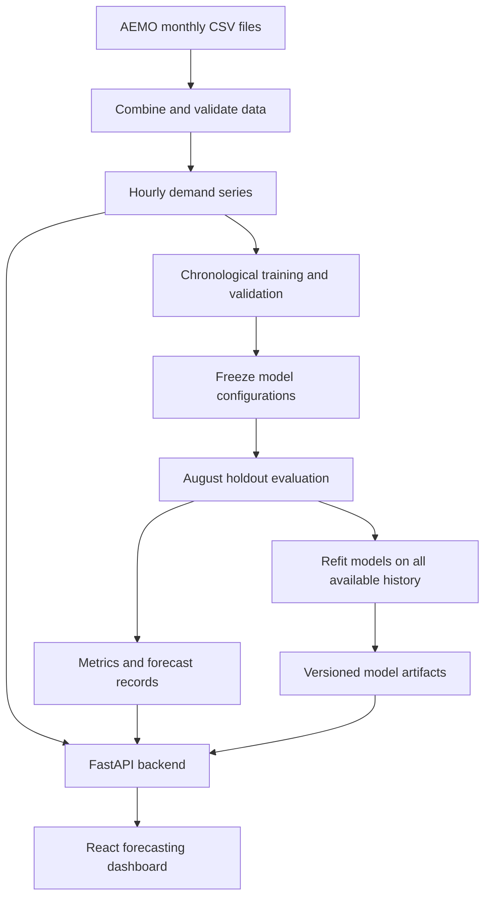

# EGridCast

**Hourly electricity demand forecasting for Victoria, Australia.**

EGridCast compares statistical, machine learning, and deep learning approaches to forecasting the next 24 hours of electricity demand. It processes AEMO National Electricity Market data for Victoria’s VIC1 region, evaluates five models under a shared forecasting protocol, and serves predictions through a FastAPI backend and an interactive React dashboard.

The project connects time-series data preparation, model training and evaluation, versioned model storage, API inference, and frontend visualisation in one application.

## Project Highlights

- **Five forecasting models:** SARIMA, XGBoost, RNN, LSTM, and Transformer.
- **Comparable evaluation:** shared forecast origins, 24-hour targets, and chronological validation and test periods.
- **Interactive dashboard:** historical demand, model-specific forecasts, forecast-horizon errors, and side-by-side model comparison.
- **Separate training and inference:** models train offline; API requests use saved models to generate predictions.
- **Traceable outputs:** evaluation reports and model artifacts record configurations, dataset hashes, and training metadata.

## System Architecture



## Data and Preprocessing

The input consists of AEMO price-and-demand CSV files for **VIC1**. The forecasting target is `TOTALDEMAND`, measured in megawatts (MW); timestamps come from `SETTLEMENTDATE`.

The preprocessing pipeline:

1. Combines monthly files, sorts records chronologically, removes duplicate source timestamps, and reports missing five-minute intervals.
2. Validates the required columns, region, timestamp alignment, and positive, finite demand values. The hourly loader rejects any remaining duplicate timestamps.
3. Aggregates five-minute observations into hourly mean demand. Entirely missing hours are rejected; partially populated hours are retained and recorded in a data quality report.
4. Builds model-specific lag features or input sequences using only observations available at the forecast origin.
5. Standardises neural-network inputs using a scaler fitted exclusively on the relevant training partition.

Timestamps use **fixed AEST (UTC+10)**, consistent with NEM market time, rather than daylight-saving local time. The models predict hourly average demand, not energy consumption.

## Forecasting Models

All models produce 24 hourly demand predictions. XGBoost and the neural models use a 168-hour history window; SARIMA uses the available observed history.

| Model | Approach | Implementation |
| --- | --- | --- |
| **SARIMA** | Seasonal statistical forecasting | SARIMAX implementation with order `(2, 0, 1)` and seasonal order `(1, 0, 1, 24)`. Fitted coefficients remain fixed while the state is updated from observed history at each forecast origin. |
| **XGBoost** | Gradient-boosted decision trees | One regressor per forecast horizon. Features include demand lags at 1, 2, 24, 48, and 168 hours; 24- and 168-hour rolling means and standard deviations; and target-hour calendar features. |
| **RNN** | Recurrent sequence modelling | A single recurrent layer with 64 hidden units maps 168 hourly observations to 24 outputs. |
| **LSTM** | Gated recurrent sequence modelling | A single LSTM layer with 64 hidden units maps 168 hourly observations to 24 outputs. |
| **Transformer** | Attention-based sequence modelling | Two encoder layers, four attention heads, 64-dimensional representations, learned positional embeddings, and a 24-output prediction head. |

Neural models use Adam optimisation, mean squared error loss, gradient clipping, and validation-based early stopping. The best validation checkpoint is restored before evaluation.

## Evaluation Methodology

Time ordering is preserved throughout training and evaluation to prevent future observations from entering model fitting or forecast inputs.

| Stage | Period or procedure |
| --- | --- |
| Development training | Available history through 31 May 2026 |
| Validation | June–July 2026 |
| Cross-validation | Three expanding-window folds within pre-August data by default |
| Final test | August 2026, held out from model selection |
| Production fit | All available history, using the frozen evaluation configuration |

Model configurations and neural training durations are frozen before final test scoring. Test models are refitted on pre-August data. Every model is scored at the same forecast origins, spaced 24 hours apart by default, with a complete 24-hour target window. Later forecasts can use newly observed history, but never observations from within their own prediction window.

Evaluation reports include:

- **MAE (MW):** average absolute forecast error.
- **RMSE (MW):** error magnitude with greater weight on larger deviations.
- **MAPE (%):** average absolute percentage error.
- **MAE by forecast horizon:** error for each hour ahead, from 1 to 24.

Each completed evaluation saves metrics, frozen configurations, and forecast-level predictions. A separate production fit retrains the models on all available history for serving; the reported holdout scores remain associated with the evaluation models.

## Application

### Frontend

The React and TypeScript dashboard provides:

- **Hourly Demand Outlook:** recent observed demand and a selected model’s next 24-hour forecast.
- **Error by Forecast Horizon:** the selected model’s MAE across the prediction window.
- **Model details:** architecture, input history window, training cutoff, and configuration.
- **24-Hour Model Comparison:** aligned forecasts from all five models on one chart.
- **Model Performance Comparison:** validation and test metrics in a comparison table.

The interface uses Recharts for visualisation, Radix UI for evaluation tabs, and responsive CSS for desktop and mobile layouts. Forecasts and metrics are retrieved from the backend.

### Backend

FastAPI exposes demand history, evaluation metrics, model availability, and forecast generation. Training runs through a separate command-line interface rather than through API requests.

Saved models include preprocessing state, configuration, training cutoff, evaluation ID, dataset hash, model checksum, and package versions. Before serving forecasts, the backend checks that the model artifacts match the current dataset.

| Endpoint | Purpose |
| --- | --- |
| `GET /api/health` | Check data and model readiness |
| `GET /api/models` | Retrieve model availability and metadata |
| `GET /api/history?hours=168` | Retrieve recent hourly demand |
| `GET /api/metrics` | Retrieve published evaluation results |
| `POST /api/forecast` | Generate a forecast for a selected model, e.g. `{"model":"LSTM"}` |
| `POST /api/forecast/compare` | Generate aligned forecasts for all five models |

## Technology Stack

| Layer | Technologies |
| --- | --- |
| Data processing | Python, pandas, NumPy |
| Statistical and machine learning models | statsmodels, XGBoost, scikit-learn |
| Deep learning | PyTorch |
| API | FastAPI, Pydantic, Uvicorn |
| Frontend | React, TypeScript, Vite, Recharts, Radix UI |
| Testing and code quality | pytest, Vitest, Playwright, Ruff, Prettier |
| Dependency management | uv, npm |

## Run Locally

### 1. Install dependencies

Requires Python 3.11+, uv, npm, and Node.js 20.19+ or 22.12+.

```bash
uv sync --group dev
npm ci --prefix frontend
```

### 2. Prepare the data

Data and trained artifacts are excluded from Git. Place the monthly VIC1 files matching `PRICE_AND_DEMAND_*_VIC1.csv` in `data/raw/`, then run:

```bash
uv run python scripts/combine_files.py
uv run egridcast inspect
```

Alternatively, provide an existing combined CSV at `data/processed/PRICE_AND_DEMAND_2025_26_VIC1.csv`. The evaluation pipeline expects data covering the training, validation, and test periods described above.

### 3. Evaluate and train

```bash
uv run egridcast evaluate --folds 3 --epochs 30 --stride 24 --trees 800 --sarima-maxiter 100 && \
  uv run egridcast production-fit
```

Evaluation must complete successfully before production fitting begins. Training runs on CPU and can take substantial time, particularly for SARIMA and Transformer models. If SARIMA does not converge, increase `--sarima-maxiter` and rerun evaluation.

### 4. Start the application

Run the backend and frontend in separate terminals:

```bash
# Backend
uv run uvicorn egridcast.api:app --reload --host 127.0.0.1 --port 8000
```

```bash
# Frontend
npm run dev --prefix frontend
```

Open the dashboard at **http://localhost:5173** and the interactive API documentation at **http://127.0.0.1:8000/docs**. Forecasts require trained production artifacts; evaluation metrics require a completed evaluation run.

### Configuration

| Environment variable | Default |
| --- | --- |
| `EGRIDCAST_DATA` | `data/processed/PRICE_AND_DEMAND_2025_26_VIC1.csv` in the repository |
| `EGRIDCAST_ARTIFACTS` | `artifacts/` in the repository |
| `EGRIDCAST_CORS_ORIGIN` | `http://localhost:5173` |
| `VITE_API_URL` | Empty; the development server proxies `/api` to the backend |

## Repository Structure

```text
EGridCast/
├── src/egridcast/
│   ├── models/          # Statistical, boosted-tree, and neural models
│   ├── data.py          # Validation, resampling, and feature construction
│   ├── evaluation.py    # Chronological folds and forecast scoring
│   ├── training.py      # Offline evaluation and production fitting
│   ├── artifacts.py     # Model persistence and metadata
│   ├── services.py      # History, metrics, and inference services
│   ├── schemas.py       # API request and response schemas
│   └── api.py           # FastAPI routes
├── frontend/            # React dashboard and frontend tests
├── scripts/             # Data preparation utilities
├── tests/               # Backend tests
├── data/                # Local input and processed data (not tracked)
└── artifacts/           # Local evaluation and model outputs (not tracked)
```

## Testing

Backend tests cover data validation, sequence and feature alignment, chronological splits, scaler isolation, model outputs, artifact persistence, and API behaviour. Frontend tests cover chart data alignment, and browser tests exercise the dashboard.

```bash
uv run pytest
uv run ruff check src scripts tests
npm test --prefix frontend
npm run build --prefix frontend
```

Run `npm run test:e2e --prefix frontend` with both application servers running to execute the browser tests.

## Scope and Future Work

EGridCast currently uses a historical dataset rather than a live AEMO feed. Forecasts are point estimates based on demand history and calendar features; weather, public holidays, and prediction intervals are not yet included. Evaluation uses fixed historical periods and daily forecast origins by default.

Future extensions include live data ingestion, weather and holiday features, probabilistic forecasts, broader hyperparameter optimisation, and monitoring for forecast drift and scheduled retraining.
